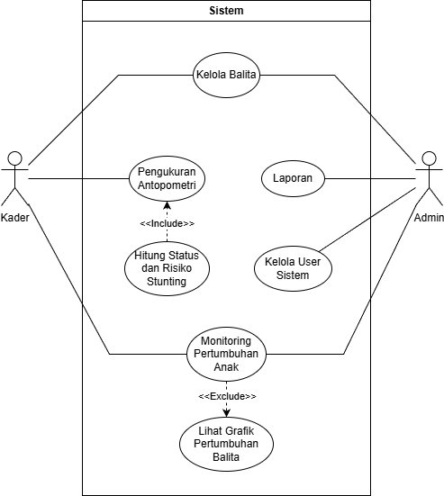
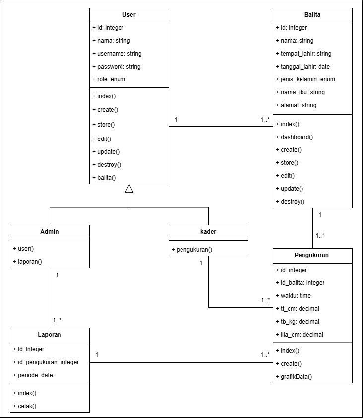
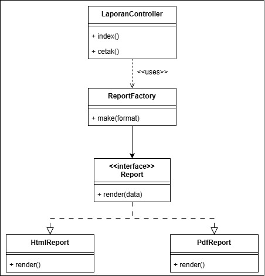
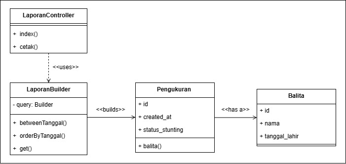
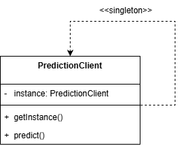
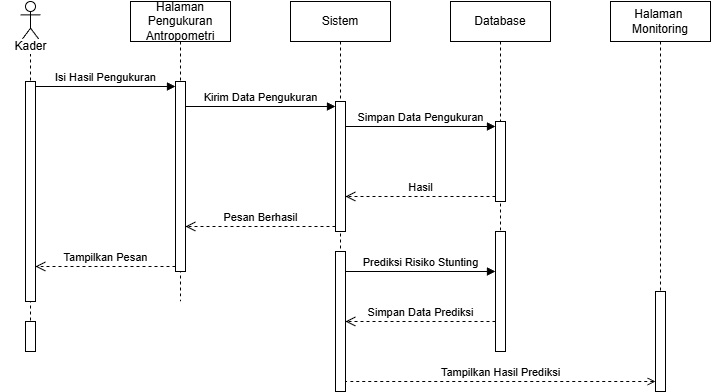
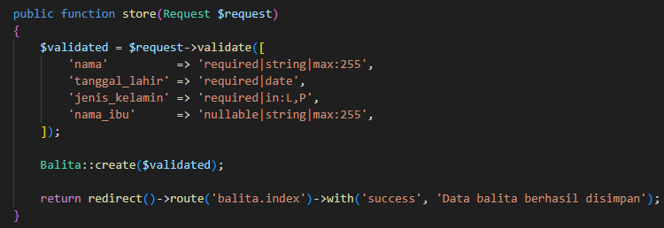
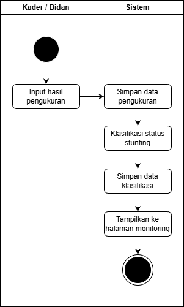
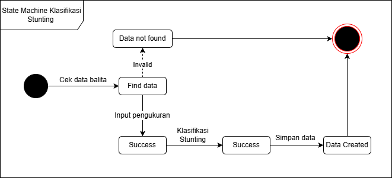

# 📘 Sistem Monitoring Risiko Stunting Posyandu (SMRSP) Bougenville

Repositori ini berisi dokumentasi pengembangan **Sistem Monitoring Risiko Stunting Posyandu (SMRSP) Bougenville**.  

---

## 🧭 Daftar Isi

- [Deskripsi Singkat Sistem](#deskripsi-singkat-sistem)
- [Standar Implementasi dan Coding Convention](#standar-implementasi-dan-coding-convention)
- [Tahapan Software Testing](#tahapan-software-testing)
- [Peran Software Quality Assurance (SQA)](#peran-software-quality-assurance-sqa)
- [Struktur Folder Desain Sistem](#struktur-folder-desain-sistem)
- [Desain Sistem](#desain-sistem)
  - [Use Case Diagram](#use-case-diagram)
  - [Class Diagram](#class-diagram)
  - [Dependency Injection](#dependency-injection)
  - [Factory Method](#factory-method)
  - [Builder](#builder)
  - [Singleton](#singleton)
  - [Sequence Diagram](#sequence-diagram)
  - [Activity Diagram](#activity-diagram)
  - [State Machine Diagram](#state-machine-diagram)
- [Cara Instalasi](#cara-instalasi)

---

## 🧪 Tahapan Software Testing

Pengujian perangkat lunak dilakukan untuk memastikan bahwa sistem berjalan sesuai dengan kebutuhan fungsional yang telah ditentukan. Tahapan software testing pada sistem SMRSP meliputi:

1. **Perencanaan Pengujian**  
   Menentukan fitur dan fungsi sistem yang akan diuji.

2. **Penyusunan Skenario Pengujian**  
   Menyusun skenario pengujian berdasarkan input dan output yang diharapkan.

3. **Pelaksanaan Pengujian**  
   Pengujian dilakukan menggunakan metode **Black Box Testing**, dengan fokus pada pengujian fungsi sistem tanpa melihat struktur kode internal.

4. **Evaluasi Hasil Pengujian**  
   Membandingkan hasil aktual dengan hasil yang diharapkan.

5. **Perbaikan dan Pengujian Ulang**  
   Melakukan perbaikan apabila ditemukan kesalahan, kemudian dilakukan pengujian ulang.

---

## 🛡️ Peran Software Quality Assurance (SQA)

Software Quality Assurance (SQA) berperan dalam menjaga kualitas perangkat lunak agar sistem yang dikembangkan memenuhi standar kualitas yang telah ditetapkan. Penerapan SQA pada sistem SMRSP dilakukan untuk memastikan bahwa setiap tahapan pengembangan berjalan sesuai prosedur.

Peran SQA dalam sistem ini meliputi:
- Menjamin fungsionalitas sistem sesuai kebutuhan pengguna
- Menjaga stabilitas dan keandalan sistem
- Memastikan kemudahan penggunaan sistem
- Mendukung kemudahan pemeliharaan dan pengembangan sistem

Dengan penerapan SQA, kualitas sistem dapat terjaga secara berkelanjutan dan sistem dapat digunakan secara optimal di lingkungan posyandu.

---

## 📝 Deskripsi Singkat Sistem

**Sistem Monitoring Risiko Stunting Posyandu** adalah sistem yang digunakan untuk **Memprediksi dan memantau risiko stunting pada balita di Posyandu Bougenville desa Margasari Kecamatan Tigaraksa Kabupaten Tangerang**. Klik link dibawah untuk selengkapnya.

[Dokumen Laporan Penelitian (Template JISKa)](https://docs.google.com/document/d/1ZoFwWu4EAAuzPiZqyTBVVw9NBTRAz3HE/edit?usp=sharing&ouid=100629304192679567901&rtpof=true&sd=true)

Fitur utama sistem antara lain:

- ✅ Fitur 1 – *Kelola Data Balita*
- ✅ Fitur 2 – *Pengukuran Antopometri*
- ✅ Fitur 3 – *Klasifikasi dan Predisi Stunting*
- ✅ Fitur 4 – *Laporan Kegiatan*
- ✅ Fitur 5 – *Dashboard Monitoring*
- ✅ Fitur 6 – *Kelola User*


---

## 🧩 Standar Implementasi dan Coding Convention

Penerapan standar implementasi dan *coding convention* yang baik bertujuan untuk meningkatkan kualitas perangkat lunak serta memudahkan proses pemeliharaan sistem. Pada pengembangan SMRSP, standar implementasi diterapkan dengan menyelaraskan hasil perancangan UML dengan kode program yang dikembangkan.

Coding convention diterapkan melalui:
- Penamaan variabel, fungsi, dan kelas yang konsisten dan deskriptif
- Struktur folder aplikasi yang terorganisir
- Penulisan kode yang rapi dan konsisten
- Pemberian komentar pada bagian kode penting

Dengan penerapan standar implementasi dan coding convention tersebut, kode program menjadi lebih mudah dipahami, mengurangi risiko kesalahan, serta mempermudah proses perawatan dan pengembangan sistem di masa mendatang.

---

## 📂 Struktur Folder Desain Sistem

Folder ini berisikan diagram dan gambar desain sistem diantaranya:

```bash
.
├── README.md
├── docs/
│   ├── usecase-diagram.png
│   ├── class-diagram.png
│   ├── factory-method.png
│   ├── builder.png
│   ├── singelton.png
│   ├── dependency-injection.png
│   ├── activity-diagram.png
│   ├── state-machine-diagram.png
│   └── SMRSP.drawio
```
---

## 📊 Desain Sistem

### Use Case Diagram

<p align="center">
  
</p>

### Class Diagram

<p align="center">
  
</p>

### Factory Method

<p align="center">
  
</p>

### Builder

<p align="center">
  
</p>

### Singleton

<p align="center">
  
</p>

### Sequence Diagram

<p align="center">
  
</p>

### Dependency Injection

<p align="center">
  
</p>

### Activity Diagram

<p align="center">
  
</p>

### State Machine Diagram

<p align="center">
  
</p>

---

## ⬇️ Cara Instalasi

```
git clone https://github.com/RamziAhmar/SMRSP-Margasari.git
```
```
cd SMRSP-Margasari
```
```
composer install
```
```
npm install
```
```
php artisan migrate
```
```
php artisan generate:key
```
```
npm run dev
```
buka terminal baru dan jalankan 
```
php artisan serve
```
Server akan berkalan di localhost:9000
